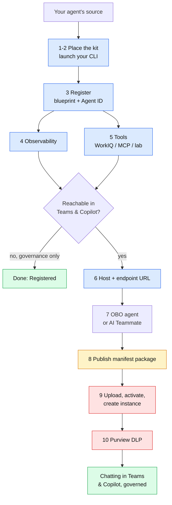

# Onboarding a custom agent to Microsoft Agent 365: end to end

This is the complete walkthrough, from your existing agent's source code to an agent that is registered in Agent 365, has an Entra identity, emits observability, can use tools and, if you want it, answers in Microsoft Teams and Microsoft 365 Copilot with Purview and Defender watching.

You drive it from an AI coding CLI (Claude Code, GitHub Copilot CLI, Cursor, Codex, Gemini CLI, and others). The kit places a set of skills into your project; the CLI reads them and does the work. You type plain-English phrases; a few commands you run yourself, and those are called out explicitly.

Every step is labelled by **who** performs it:

- **[CLI]** the AI CLI does it when you ask
- **[you]** one command in your own terminal
- **[admin]** a tenant admin, in a portal



<sub>Blue = the AI CLI does it · amber = you, in your own terminal · red = an admin, in a portal · green = a finish line.</sub>

---

## Which languages this covers

Agent 365 ships SDKs for **Python, Node.js / TypeScript and .NET**, and this kit follows that boundary. There is no Java, Go or Rust SDK on any public registry today.

That boundary is narrower than it sounds, because **most of onboarding never touches your code.** The blueprint, the Agent ID, the agentic user, the endpoint registration, the manifest, the upload and the instance are all Entra, CLI and portal operations. They work the same whatever your agent is written in.

| Step | Python / Node / .NET | Any other language |
|---|---|---|
| 1–3 Register: blueprint, Agent ID, agentic user | yes | **yes** (never reads your source) |
| 4 Observability | SDK does it | raw OTLP, contract below |
| 5 Work IQ tools | SDK does it | MCP over HTTP, wire it yourself |
| 6 Messaging endpoint | host generated for you | implement the contract yourself |
| 7–10 Publish, upload, instance, DLP | yes | **yes** (CLI and portal) |

So a Java or Go agent can be registered, given an identity, published, and made chattable in Teams. What it does not get from Microsoft is the in-process instrumentation and tool wiring.

**For Java, the kit fills that in.** Say *Onboard this Java agent* and the `add-java-agent` add-on writes the HTTP host, the inbound token validation, the reply path and a direct OTLP exporter: the pieces an SDK would otherwise provide. Go and Rust have no equivalent add-on; the wire contract below is what they would need to implement.

Within the three supported languages the *framework* coverage is broad and auto-detected: LangChain, OpenAI Agents SDK, Claude Agent SDK, Google ADK, Semantic Kernel and Microsoft Agent Framework.

### Exporting telemetry without an SDK

If you are outside the three languages, the observability API is plain OTLP over HTTPS and you can post to it directly:

```
POST https://agent365.svc.cloud.microsoft/observability/tenants/{tenantId}/otlp/agents/{agentId}/traces?api-version=1
  authorization: Bearer <observability token>
  content-type: application/json
```

S2S agents post to `/observabilityService/...` instead of `/observability/...`; everything else is identical.

Every span must carry all three of these or it is **dropped without an error**:

| Attribute | Value |
|---|---|
| `gen_ai.operation.name` | one of `invoke_agent`, `execute_tool`, `output_messages`, `chat`, `apply_guardrail` |
| `microsoft.tenant.id` | your tenant GUID |
| `gen_ai.agent.id` | the agent instance appId |

`microsoft.agent.user.id` is optional and carries the agentic user id.

Spans whose operation name is not in that set are filtered out by design. That is how the exporter ignores HTTP and database spans, and it is why a hand-rolled exporter that omits the attribute sends nothing while appearing to succeed.

This contract is read from the shipped SDK source, and the same endpoint is confirmed working against a live tenant through the Python SDK. A hand-written client has not been tested end to end.

---

## Before you start

**On your machine:** Node.js 18+, .NET SDK 8+, the `a365` CLI, Azure CLI, Git, an AI coding CLI (below), and Python 3.10+ or Node.js for your agent. The kit's launcher checks all of this and prints the install command for anything missing.

```bash
# .NET SDK 8+ first (the a365 CLI is a .NET tool), then the a365 CLI
winget install --id Microsoft.DotNet.SDK.8 -e        # macOS: brew install --cask dotnet-sdk
dotnet tool install -g Microsoft.Agents.A365.DevTools.Cli
winget install --id Microsoft.AzureCLI -e            # macOS: brew install azure-cli
```

**An AI coding CLI (install at least one).** This is the tool you drive the onboarding from. Pick whichever you use:

```bash
npm install -g @github/copilot            # GitHub Copilot CLI
npm install -g @anthropic-ai/claude-code  # Claude Code
```

Cursor, Codex and Gemini CLI also work. Install them from their own docs; the kit's skills are already in the `.agents/skills/` folder they read.

**Windows:** use a normal terminal, never an elevated one, because the per-user tools (the AI CLI, `a365`, `az`) are invisible to an Administrator shell.

**Your tenant, once [admin]:** the `a365` CLI needs a one-time app registration. Any admin runs this and every developer inherits it:

```bash
a365 setup requirements
```

Requires Application Administrator (lightest), Cloud Application Administrator, or Global Administrator.

**Sign in [you]:**

```bash
az login --allow-no-subscriptions
```

**A model provider key for the agent itself.** The kit onboards an agent; it does not give it one to think with. Your agent project needs whatever key its framework expects in its own `.env` (`ANTHROPIC_API_KEY`, `OPENAI_API_KEY`, `AZURE_OPENAI_ENDPOINT` and friends) before it can answer anything. Skip it and the agent still registers, still publishes, still appears in Teams, and fails on the first message.

**Only if you plan to do Step 6 (chatting in Teams):** a dev tunnel, to give the host on your laptop a public HTTPS URL.

```bash
winget install Microsoft.devtunnel     # macOS/Linux: https://aka.ms/devtunnels/download
devtunnel user login
```

`devtunnel user login` is a separate sign-in from `az login` and is easy to forget; without it `devtunnel host` fails at the point you need it.

---

## Step 1: Put the kit in your agent project

> Starting from one of the repository's samples instead of your own agent? Use the workspace tool described in the README's *Start from a sample instead*; it places the kit for you. Then continue from Step 2 in that directory.

> **Do not use GitHub's green Code > Download ZIP button.** That gives you
> `agent365-sdk-onboarding-experience-main.zip`, which is the whole *repository* inside a wrapper
> folder. Extracting it puts the skills where no CLI looks, and the failure is silent: the
> extraction succeeds and then your CLI finds no skills. You want the **release asset**,
> which is the kit itself with no wrapper.

Everything happens in the **root of your agent project**, the folder containing your
agent's source. Three commands, and this is the entire install.

**Windows PowerShell:**

```powershell
cd C:\path\to\your-agent-project
```

```powershell
Invoke-WebRequest -Uri "https://github.com/AkramMSFT/agent365-sdk-onboarding-experience/releases/latest/download/agent365-onboarding-kit-latest.zip" -OutFile "kit.zip"
```

```powershell
Expand-Archive -Path kit.zip -DestinationPath . -Force
```

**macOS / Linux:**

```bash
cd ~/path/to/your-agent-project
```

```bash
curl -L -o kit.zip https://github.com/AkramMSFT/agent365-sdk-onboarding-experience/releases/latest/download/agent365-onboarding-kit-latest.zip
```

```bash
unzip -o kit.zip -d . && chmod +x agent365-kit.sh
```

That URL always resolves to the newest release, so it does not go stale. Delete `kit.zip`
afterwards if you like; nothing depends on it.

The archive has no wrapper directory, so extracting in place gives you:

```
your-agent-project/
  .a365-kit/          skills, add-ons, validators, prerequisite doctor
  .claude/skills/     discovery copy for Claude Code
  .agents/skills/     discovery copy for Copilot, Cursor, Codex, Gemini, Amp, Cline and others
  agent365-kit.ps1    launcher (Windows)
  agent365-kit.sh     launcher (macOS / Linux)
  src/  ...           your agent, already here
```

Starting from nothing? Extract into an empty folder, and the skills can scaffold a starter agent.

Committing these folders to your repo is the recommended end state: the skills then travel with the project and teammates need no download.

## Step 2: Check prerequisites and start your CLI

**First, run the launcher.** It changes nothing: it verifies prerequisites, prints the
install command for anything missing, detects which CLIs you have, and lists every phrase
you can use.

```powershell
.\agent365-kit.ps1
```

```bash
./agent365-kit.sh
```

Fix anything it flags, open a **new** terminal so freshly installed tools are on PATH, and
run it again until everything passes.

**Then start your CLI, from this same folder.** Run one of these:

```bash
copilot
```

```bash
claude
```

Cursor, Codex, Gemini CLI, Amp, Cline, OpenCode, Warp and Antigravity all read
`.agents/skills/` at project scope: open this folder in the tool and use its chat.

**Confirm it can see the skills** before going further. In Copilot CLI type `/skills` or run
`copilot skill list` in a separate terminal; in Claude Code just ask *What Agent 365 skills
do you have?*

You should see fifteen: eight Microsoft skills plus seven kit add-ons. If you see none, the
kit was extracted somewhere other than this folder; check that `.agents` and `.claude` sit
beside your agent's source, not inside a subfolder.

<!--  -->

## Step 3: Register the agent in Agent 365  [CLI] + [you]

This is the step that puts the agent in the Agent 365 registry and gives it an Entra identity (its **Agent ID**).

**Launch your CLI from the project folder** and give it the trigger phrase. Pick your CLI:

```bash
# GitHub Copilot CLI: interactive, so you approve each action
copilot -i "Onboard this agent to Agent 365."

# Claude Code
claude "Onboard this agent to Agent 365."

# Cursor / Codex / Gemini CLI: open the project and type the phrase in chat:
#   Onboard this agent to Agent 365.
```

Prefer the interactive form over a one-shot `-p` run: registration writes to your tenant, and you want to approve each step. To rehearse first without touching anything, dry-run it:

```bash
copilot -p "Onboard this agent to Agent 365. DRY RUN - do not run commands or modify files. Report which skill you selected, what you detected, and the steps you would perform." --allow-all-tools --deny-tool shell
```

The trigger phrase is the same in every CLI:

> **Onboard this agent to Agent 365.**

The `a365-setup` skill detects your stack and asks three things:

| It asks | Choose |
|---|---|
| Confirm what it detected | `yes`, or correct it |
| Capabilities: Register · Observability · WorkIQ · AI Teammate | `1, 2` for a first run; add WorkIQ for M365 data; AI Teammate only if the agent needs its own mailbox and UPN |
| Auth mode (not asked for AI Teammate) | **OBO**. On the tenants we ran, the CLI created the delegated grants itself. Your tenant may still require an administrator to consent to the blueprint's resource permissions; setup says so if it does. |

It writes config and code, then reaches `a365 setup all`. **This command must run in your own terminal.** It signs in through the Windows broker, which cannot show a prompt inside a CLI's shell:

1. Copy the exact command from the CLI's approval prompt.
2. Decline it in the CLI.
3. Paste it into a second normal terminal in the same folder; complete the sign-in.
4. Tell the CLI: *`a365 setup all` completed in a separate terminal. Read `a365.generated.config.json` and continue.*

Optionally, in step 3, prefix the command with `node .a365-kit/run-a365.mjs` (for example `node .a365-kit/run-a365.mjs setup all …`). It runs the same CLI and sign-in, and exits with code 2 and the administrator steps if the blueprint still needs `maven-prod` observability consent, which the CLI alone reports with exit code 0.

If setup reports that the blueprint needs consent for `maven-prod [Agent365.Observability.OtelWrite]`, it could not grant the observability permission itself, which happens whenever the account running setup is not a Global Administrator. Say *Grant observability access to this agent.* The kit checks what is missing, then an administrator runs one command, signs in and confirms. Java, Go and Rust agents also need the role on the blueprint, and the add-on includes it.

This creates the **blueprint** (an Entra app registration) and, on the blueprint path, the **Agent ID** (a service-principal agent identity) in one run. For an AI Teammate the identity is a user with a UPN and mailbox, minted later at instance creation.

Then install what the skill added [you]:

```bash
pip install -r requirements.txt        # or npm install / dotnet restore
python -c "import src.agent"           # confirm it still imports
```

Python + WorkIQ: if the import fails on `microsoft_agents_a365.runtime`, add `microsoft-agents-a365-runtime>=1.0.0` and install again.

**You are now Registered.** The agent is in the Agent 365 registry with an identity. If governance is all you need, stop here.

<!--  -->

## Step 4: Add observability  [CLI]

Make the agent emit telemetry for every message, model call and tool call to the Agent 365 portal and Microsoft Defender. In your CLI, say:

> **Add observability to this agent.**

If you selected Observability as a capability in Step 3 it is already wired and this confirms it; if you did not, this adds it now. Either way the `instrument-observability` skill does the work. It uses OpenTelemetry: the SDK auto-instruments every model and tool call into spans, an `InvokeAgentScope` wraps each turn, identity baggage is stamped on the context, and an Agent 365 exporter ships the spans out.

**Then check the exporter is actually on.** The `a365` CLI writes `ENABLE_A365_OBSERVABILITY_EXPORTER=false` into `.env` during Step 3. Microsoft's skill preserves an existing value rather than overwriting it, which leaves the agent instrumented but exporting nothing and the Activity view empty; the kit changes that one value so the skill sets it (see `NOTICE.md` §10) and the validator fails if it is anything but `true`. It is still worth eyeballing, because a later `a365 setup` run can reset it:

```
ENABLE_A365_OBSERVABILITY_EXPORTER=true
A365_OBSERVABILITY_LOG_LEVEL=info
```

Restart the agent afterwards, because the value is read at startup.

Two more values in `.env` worth checking once the agent is running in Teams: `AGENT365OBSERVABILITY__AGENTID` should be the **instance** appId that Teams runs the agent as, not the identity created at setup, or activity attributes to the wrong agent. `A365_OBSERVABILITY_LOG_LEVEL` is sometimes written as the literal option list `info|warn|error`; set it to one value.

Then verify:

> **Validate A365 code.**

The `a365-code-validator` skill checks exporter activation, identity binding, token shape and the required spans, and offers fixes. Re-run it after any fix until it reports clean.

## Step 5: Tools  [CLI]

An agent gets tools three ways. Add any combination:

| Say | Adds | Governed by Agent 365? |
|---|---|---|
| *Add WorkIQ tools to this agent* | Microsoft 365 data: mail, calendar, Teams, SharePoint, OneDrive, Word, Excel | Yes, Entra-gated |
| *Add an MCP server* | any community MCP server: filesystem, git, GitHub, Postgres, web fetch, Slack, Playwright | No |
| *Add lab tools* | local utilities: web fetch, encoders, hashing, text transforms | No |

The last two are outside the Entra model, so pair them with DLP (Step 9). WorkIQ tokens are per-audience; the skill wires that. If you add several servers, tool names are namespaced automatically so they don't collide.

## Step 5a: Optional: chat with it locally, with no tunnel  [CLI]

This is not a prerequisite for Step 6; the two are alternatives. Skip it if Step 6 is going to work
for you, and use it when it will not: a network that blocks dev tunnels, an agent not
published yet, or just a faster loop while you are changing agent logic.

**One case where it is worth doing even if Step 6 would work: straight after adding tools.**
Tool wiring is where agents break, and through Teams every one of those failures looks
identical: the agent simply does not answer. A duplicate tool name across two Work IQ
servers, MCP tokens that expire after the first turn, a Work IQ 401 from a missing
environment variable: all of them reach the user as silence, and diagnosing them means
correlating Teams, the tunnel and the host log. On the dev channel you `curl` the agent and
read the exception. It separates *does the agent work* from *is the routing right*, and after
Step 5 the first question is the one you want answered.

> **Let me test this agent locally.**

The `test-local-channel` add-on adds a second listener on its own port, bound to `127.0.0.1`,
serving `/dev/chat` and `/dev/health`. It calls the same function your production handler
calls, so you are exercising the real agent rather than a copy. `/api/messages` is untouched
and stays fully authenticated.

It is **off by default**. Turn it on for a session:

```bash
A365_DEV_CHANNEL=true python host_agent_server.py     # Node.js: npm start | .NET: dotnet run
```

Then talk to it:

```bash
curl -s -X POST http://127.0.0.1:3999/dev/chat -H "content-type: application/json" -d "{\"text\":\"hello\"}"
```

On Windows, put the body in a file and use `--data @body.json`, because quoting JSON inline in
PowerShell is more trouble than it is worth.

This channel **bypasses authentication**, which is the entire
point and also the risk. Never set `A365_DEV_CHANNEL=true` outside local development, and
never point a tunnel at the dev port.

The guard is also not the one you would expect. `devtunnel host` runs on your own machine and
forwards to a local port, so a request from the public internet still arrives looking like
`127.0.0.1`:

```
local request  ->  peer=127.0.0.1  xff=None
via tunnel     ->  peer=127.0.0.1  xff=40.65.108.177
```

A loopback check alone would let tunnelled traffic straight through. The channel refuses any
request carrying forwarding headers instead, which is why it returns 403 rather than an
answer if something proxies to it.

If the agent is an AI Teammate, *Test this agent locally* is the better route: it opens
AgentsPlayground against the standard endpoint. This add-on is for the blueprint path, which
that skill does not cover.

## Step 6: Make it reachable in Teams and Copilot  [CLI] + [you]

Only if you want users to chat with it. In your CLI:

> **Make this agent chattable in Teams.**

The `add-messaging-endpoint` add-on:

- adds an HTTP host serving `/api/messages` (for a blueprint agent built from a CLI or library; the AI Teammate path scaffolds its own host),
- proves it locally (health check returns 200; an anonymous message returns 401),
- exposes it through a dev tunnel or a URL you host,
- registers the endpoint on the blueprint [CLI]:

```bash
a365 setup blueprint --update-endpoint https://<host>/api/messages --m365
```

`--m365` is required. Without it the Teams routing is silently skipped. Verified on CLI 1.1.221; newer CLI documentation says endpoint-only updates infer it, so keeping the flag explicit costs nothing and works on both.

If you are tunnelling, that is three commands in a terminal of their own, left running:

```bash
devtunnel create <agent-name>-tunnel --allow-anonymous
devtunnel port create <agent-name>-tunnel -p 3978 --protocol http
devtunnel host <agent-name>-tunnel
```

Use the port your host actually binds; `3978` is the generated default. `--protocol http` matters: without it the relay attempts TLS to a plain-HTTP host and Teams sees a 502. Take the public URL from the line `devtunnel host` prints. Do not build it from the tunnel name: a recreated tunnel can land in a different cluster and the derived URL will be wrong.

**Confirm the registration landed.** `a365.generated.config.json` in your project should now show your URL under `messagingEndpoint` and `"completed": true` at the root. If `completed` is `false` or the endpoint is empty, the command did not finish, so re-run it rather than moving on.

Then run one command in your own terminal [you], because it needs the broker:

```bash
a365 setup permissions bot
```

Verify in the Teams Developer Portal (the CLI gives you the link) that **Agent Type = API Based** and the **Notification URL** matches your endpoint.

**Leave the host running.** Teams delivers every message to that URL over HTTP; if nothing is listening, each one fails in the chat with no clue as to why. Start it in its own terminal and keep it there for as long as you want the agent to answer:

```bash
python host_agent_server.py     # Node.js: npm start
```

From here on you are running three terminals: the tunnel, the host, and the one you drive your AI CLI from.

<!--  -->

## Step 7: Choose the path: OBO agent or AI Teammate

This decides what happens in Steps 8–9. It was set by your capability choice in Step 3.

| | Blueprint / OBO agent | AI Teammate |
|---|---|---|
| Identity | service principal, created at setup | agentic user with UPN + mailbox, minted at instance creation |
| Acts as | the signed-in user (delegated) | itself |
| Use when | the agent runs elsewhere, or should chat as the caller | the agent should be a member of the org, receive email, be @mentioned |
| Publish command | `a365 publish --aiteammate true` (verified; see the note under Step 8) | `a365 publish` |

Both paths require the package upload (Step 8) to appear in Teams and Copilot. The difference is only the publish flag and when the identity is created.

## Step 8: Publish the manifest package  [you]

The manifest is the Teams app definition: the JSON that makes the agent an installable app and (via `copilotAgents.customEngineAgents`) a Microsoft 365 Copilot custom engine agent. **The CLI owns it; do not hand-edit.** Run in your own terminal (it block-buffers under a CLI):

```bash
a365 publish                    # AI Teammate
a365 publish --aiteammate true  # blueprint / OBO agent (flag selects the package format; does not change the agent's kind)
```

That flag is the one thing that got a blueprint agent into Teams on CLI 1.1.221 (verified 2026-09-04, and again in the September audit). Two cautions: check `a365 publish --help` on a newer CLI before assuming the flag still means only a package format, and after publishing re-read `a365.config.json` to confirm `aiTeammate` is still `false`. If you see "Nothing to publish", that is this case, not a broken setup.

This writes `manifest/manifest.json` and `manifest/manifest.zip`. Edit `name.short` (30 chars max), the description and icons in `manifest/manifest.json` if you want, then run it again.

<!--  -->

## Step 9: Upload, activate, create the instance  [admin]

Portal only; there is no CLI upload API. The roles that can manage agents in the admin center are **AI Administrator** and **Global Administrator**; older guidance naming Teams Administrator alone is out of date.

1. In **Microsoft 365 admin center > Agents > All agents > Upload custom agent**, upload `manifest/manifest.zip`.
2. **Activate**: scope the audience (start with yourself) and grant the requested permissions.
3. **Create instance**. For an AI Teammate this mints the agentic user.

User-driven alternative if you lack the Teams Admin role: sideload the same zip via **Teams > Apps > Manage your apps > Upload a custom app**, then **Request Instance**; an admin approves at `admin.cloud.microsoft/#/agents/all/requested`.

Provisioning is asynchronous and takes a few minutes, occasionally longer. If **Request Instance** is disabled, Agent 365 Frontier is not enabled on the tenant.

<!--  -->
<!--  -->
<!--  -->

## Step 10: Govern with Purview DLP  [CLI] + [admin]

> **Add Purview DLP to my agent.**

Microsoft's `purview-dlp-integration` skill copies a guard into your agent and wires it before the model call: each prompt goes to Graph `processContent` and is blocked when a policy matches. Replies can be sent for audit, but this workload does not block them. The skill then runs two scripts, which need an administrator [admin]:

1. `Grant-DelegatedGraphScope.ps1` appends `Content.Process.User` to the agent's delegated grant. S2S agents use `Grant-ContentProcessAppRole.ps1` instead.
2. `New-AiAppDlpPolicy.ps1` creates the app-scoped policy and blocking rule, or you pick an existing policy, or skip.
3. Pay-as-you-go billing and DSPM for AI must be on; the skill's portal guide covers both.

The kit adds `.a365-kit/shared/purview-kit-notes.md`, which the skill reads first. It covers projects wired by the kit's earlier DLP add-on, the app id the policy must match, which admin roles each script needs, and the Insider Risk steps: Audit on, a policy from the *Risky Agents (preview)* template with the *Exposing agent to risky prompt* indicator, and Defender XDR alert sharing.

Then test one benign prompt and one synthetic matching prompt such as a Luhn-valid test card number. Success is the agent's `[purview] uploadText -> BLOCKED` log line and no model call for that turn.

Allow up to 24 hours for the first evaluation.

<!--  -->

## Test

- **Before upload, AI Teammate:** *Test this agent locally* opens AgentsPlayground against your host.
- **Before upload, blueprint agent:** the dev channel from Step 5a, with no tunnel, no tenant and no Teams.
- **After upload and activation:** search Teams for the agent by name and chat with it. It also appears in the Microsoft 365 Copilot agent picker.

<!--  -->

---

## The commands you run yourself

Everything else is done by the CLI or a portal. These four need your own terminal:

| When | Command | Why |
|---|---|---|
| Step 3 | `a365 setup all …` | Windows broker sign-in |
| Step 6 | `a365 setup permissions bot` | broker + a consent prompt (blueprint path) |
| Step 8 | `a365 publish [--aiteammate true]` | buffers under a CLI shell |
| Steps 6, 9, 10 | Dev Portal, admin center, Purview | portal-only, no API |

## Troubleshooting

| Symptom | Cause and fix |
|---|---|
| `claude` / `a365` / `copilot` "not found" but installed | Elevated shell. Use a normal one. |
| `a365 setup all` times out / `MSAL … Status 17` | It authenticates via the broker; run it in your own terminal, not through the CLI. |
| `a365 publish` says "Nothing to publish for blueprint-based agents" | Use `a365 publish --aiteammate true` on the blueprint path (verified on CLI 1.1.221); confirm `a365.config.json` still says `aiTeammate: false` afterwards. |
| Agent registered but not in Teams | The package must be uploaded and activated (Steps 8–9) on both paths. |
| Span export returns 401 or 403, or setup mentions `maven-prod` | The observability permission is missing. Say *Grant observability access to this agent.* and have an administrator grant what it reports. |
| WorkIQ tools all return 401; agent says it has none | Set `PYTHON_ENVIRONMENT=Production` in `.env`, then restart the host. |
| `UserError: Duplicate tool names across MCP servers` | Several WorkIQ servers collide; the add-on sets `include_server_in_tool_names`, so re-run it. |
| A jailbreak-style or blocked prompt gets an error reply, or text starting `Exception caught :` | The host turned the model's refusal into an error. Hosts generated before kit 0.2.12 lack the reply helper; ask your CLI to *apply `.a365-kit/shared/turn-replies.md` to this agent*. The user then gets a plain refusal, and other errors an apology without the error text. |
| One WorkIQ server fails and the agent loses every tool, or the whole turn fails | The SDK fails the run when any one server fails. Agents wired before kit 0.2.11 lack the per-server check; re-run *Add WorkIQ tools to this agent*. The log then names each server it skipped. |
| Import fails on `microsoft_agents_a365.runtime` | Add `microsoft-agents-a365-runtime>=1.0.0` and install. |
| `agent365-kit.ps1 -Update` stops with "Refusing to replace a linked project path" in a OneDrive folder | Launchers before kit 0.2.12 took OneDrive's synced folders for links. Extract the new kit zip over the project once; later updates work. |
| Endpoint stops working after a tunnel restart | A recreated tunnel can change cluster; re-run the Step 6 `--update-endpoint` with the new URL. |
| Teams turn fails with `MCPError` on a later message | External MCP tokens expire; keep servers open for the host's lifetime, not per turn. |
| Agent answers nothing in Teams, host log shows no request | Nothing is listening, or the tunnel is down. Both must be running; re-check the Notification URL matches the current tunnel URL. |
| Host starts, but every turn fails on the model call | No model provider key in `.env` (`ANTHROPIC_API_KEY`, `OPENAI_API_KEY`, `AZURE_OPENAI_*`). Onboarding does not supply one. |
| Dev channel returns 403 instead of an answer | The request carried a forwarding header, so it was treated as proxied. Call `127.0.0.1` directly rather than through a tunnel or proxy. |
| Dev channel port refuses the connection | `A365_DEV_CHANNEL` is not `true`. It is off by default and set per session, not in `.env`. |
| `devtunnel host` fails to start | `devtunnel user login` has not been run, or the session expired. It is separate from `az login`. |
| Log shows `EndpointInvalid` / `Tenant id  is invalid` (note the blank) | The exporter got an un-awaited coroutine instead of a token, not a bad tenant. Python OBO agents onboarded before this kit version need the sync resolver bridge, so re-run *Add observability to this agent*. |
| Everything works but Activity stays empty after hours | `ENABLE_A365_OBSERVABILITY_EXPORTER` is not `true`, or `AGENT365OBSERVABILITY__AGENTID` is not the instance appId. See Step 4. Indexing also lags 15–90 min after the first export. |

## Going deeper

- [`docs/STEP-BY-STEP.md`](docs/STEP-BY-STEP.md): the phrases for each stage, condensed.
- [`docs/LIFECYCLE.md`](docs/LIFECYCLE.md): the reasoning behind each step.
- [`docs/USING-WITH-YOUR-CLI.md`](docs/USING-WITH-YOUR-CLI.md): per-CLI setup and differences.
- [`NOTICE.md`](NOTICE.md): what is Microsoft's and what the kit adds.
